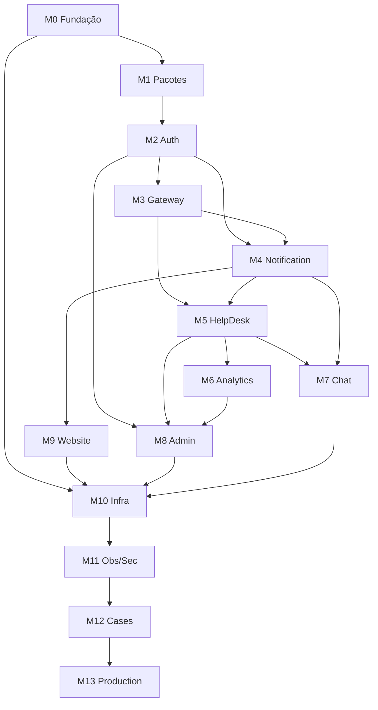

# 09 — Roadmap

**Versão:** 1.1  
**Status:** Em execução  
**Última atualização:** 2026-07-03  
**Relacionado:** [00-Vision.md](./00-Vision.md), [10-Backlog.md](./10-Backlog.md), [11-Definition-of-Done.md](./11-Definition-of-Done.md)

---

## Progresso da implementação (2026-07-03)

| Milestone                 | Status                       |
| ------------------------- | ---------------------------- |
| M0 Fundação               | ✅ Concluído                 |
| M1 Pacotes compartilhados | ✅ Concluído                 |
| M2 Auth Service           | ✅ Concluído                 |
| M3 API Gateway            | ✅ Concluído                 |
| M4 Notification Service   | ✅ Concluído (core)          |
| M5 HelpDesk SaaS          | ✅ Concluído                 |
| M6 Analytics              | ✅ Concluído                 |
| M7 Realtime Chat          | ✅ Concluído                 |
| M8 Admin Portal           | ✅ Concluído                 |
| M9 NovaDesk Website       | ✅ Concluído                 |
| M10 CapRover / Infra      | ✅ captain-definition + docs |
| M11–M13 Obs/Prod          | 🔲 Parcial                   |

---

## 1. Visão geral

O desenvolvimento do NovaDesk segue 14 milestones sequenciais (M0–M13), cada um entregando valor incremental e mantendo o ecossistema em estado deployável. A duração estimada total é de **24–30 semanas** em ritmo de desenvolvimento individual em tempo integral.

```
M0 ──► M1 ──► M2 ──► M3 ──► M4 ──► M5 ──► M6 ──► M7 ──► M8 ──► M9 ──► M10 ──► M11 ──► M12 ──► M13
Fund.  Pkgs   Auth   GW     Notif  Help   Anlyt  Chat   Admin  Web    Infra   Obs/S  Cases  Prod
 2w     3w     3w    1w     2w     4w     2w     2w     2w     2w     2w      2w     1w     2w
```

---

## 2. Milestones

### M0 — Fundação do Monorepo (Semanas 1–2)

**Objetivo:** Estabelecer a base do monorepo com tooling, governança e infraestrutura local mínima.

| Entregável           | Critério de sucesso                     |
| -------------------- | --------------------------------------- |
| Monorepo configurado | pnpm workspaces + Turborepo funcionando |
| Tooling              | ESLint, Prettier, Husky, commitlint     |
| Docker Compose base  | PostgreSQL + Redis rodando              |
| CI skeleton          | Pipeline lint + typecheck               |
| Documentação         | Todos os docs de engenharia completos   |

**Dependências:** Nenhuma (primeiro milestone).

**Backlog:** BL-001 a BL-045

---

### M1 — Pacotes Compartilhados (Semanas 3–5)

**Objetivo:** Criar todos os pacotes compartilhados que serão consumidos por serviços e apps.

| Entregável             | Critério de sucesso                     |
| ---------------------- | --------------------------------------- |
| `@novadesk/typescript` | Configs base publicadas                 |
| `@novadesk/eslint`     | Regras compartilhadas                   |
| `@novadesk/config`     | Schemas Zod de env vars                 |
| `@novadesk/shared`     | Tipos, enums, schemas, utils            |
| `@novadesk/logger`     | Logger Pino com context                 |
| `@novadesk/auth`       | JWT utils, guards, client               |
| `@novadesk/sdk`        | HTTP client base                        |
| `@novadesk/ui`         | Design system inicial (10+ componentes) |

**Dependências:** M0.

**Backlog:** BL-046 a BL-115

---

### M2 — Auth Service (Semanas 6–8)

**Objetivo:** Serviço central de identidade, autenticação e autorização.

| Entregável             | Critério de sucesso            |
| ---------------------- | ------------------------------ |
| Registro e login       | Fluxo completo com JWT RS256   |
| Refresh token rotation | Com reuse detection            |
| Password reset         | Via e-mail (mock em local)     |
| Gestão de tenants      | CRUD multi-tenant              |
| RBAC                   | Roles e permissions            |
| JWKS endpoint          | Chaves públicas para validação |
| Audit log              | Eventos de segurança           |
| Testes                 | ≥ 80% cobertura                |
| Docker + CI            | Build e deploy funcionando     |

**Dependências:** M0, M1.

**Backlog:** BL-116 a BL-163

---

### M3 — API Gateway (Semana 9)

**Objetivo:** Ponto de entrada único com roteamento, auth e rate limiting.

| Entregável      | Critério de sucesso      |
| --------------- | ------------------------ |
| Roteamento      | Proxy para Auth Service  |
| JWT validation  | Via JWKS do Auth Service |
| Rate limiting   | Redis-based              |
| Request ID      | Geração e propagação     |
| Health agregado | Status de serviços       |
| Circuit breaker | Proteção contra falhas   |

**Dependências:** M2.

**Backlog:** BL-164 a BL-190

---

### M4 — Notification Service (Semanas 10–11)

**Objetivo:** Serviço de notificações por e-mail e in-app.

| Entregável           | Critério de sucesso        |
| -------------------- | -------------------------- |
| E-mail transacional  | Templates HTML, envio SMTP |
| In-app notifications | CRUD, mark as read         |
| BullMQ consumer      | Processamento de eventos   |
| Templates            | Verificação, reset, ticket |
| Delivery tracking    | Status e retry             |

**Dependências:** M2, M3.

**Backlog:** BL-191 a BL-228

---

### M5 — HelpDesk SaaS (Semanas 12–15)

**Objetivo:** Sistema completo de tickets com frontend e backend.

| Entregável      | Critério de sucesso                 |
| --------------- | ----------------------------------- |
| HelpDesk API    | CRUD tickets, comments, categories  |
| Ticket workflow | Status transitions com validação    |
| SLA             | Políticas e monitoring              |
| Multi-tenancy   | Isolamento por tenant + RLS         |
| HelpDesk App    | UI completa para agentes e usuários |
| Integração      | Notificações e eventos              |
| E2E             | Fluxos críticos testados            |

**Dependências:** M2, M3, M4.

**Backlog:** BL-229 a BL-293

---

### M6 — Analytics Dashboard (Semanas 16–17)

**Objetivo:** Dashboard de métricas e relatórios.

| Entregável        | Critério de sucesso               |
| ----------------- | --------------------------------- |
| Analytics API     | Agregações, KPIs, trends          |
| Event consumption | Processamento de eventos HelpDesk |
| Analytics App     | Dashboards com gráficos           |
| Export            | CSV de relatórios                 |
| Cache             | Redis para queries pesadas        |

**Dependências:** M5.

**Backlog:** BL-294 a BL-336

---

### M7 — Realtime Chat (Semanas 18–19)

**Objetivo:** Chat em tempo real integrado ao HelpDesk.

| Entregável           | Critério de sucesso           |
| -------------------- | ----------------------------- |
| WebSocket server     | Socket.IO com auth            |
| Salas de chat        | Por ticket                    |
| Mensagens            | Envio, recebimento, histórico |
| Presença             | Online/offline/typing         |
| Integração HelpDesk  | Widget de chat no ticket      |
| Notificações offline | Via Notification Service      |

**Dependências:** M5, M4.

**Backlog:** BL-337 a BL-374

---

### M8 — Admin Portal (Semanas 20–21)

**Objetivo:** Portal de administração centralizada.

| Entregável         | Critério de sucesso       |
| ------------------ | ------------------------- |
| Gestão de tenants  | CRUD completo             |
| Gestão de usuários | CRUD, roles, convites     |
| Dashboard admin    | Visão geral da plataforma |
| Audit log viewer   | Visualização de logs      |
| Health dashboard   | Status dos serviços       |

**Dependências:** M2, M3, M5, M6.

**Backlog:** BL-375 a BL-407

---

### M9 — NovaDesk Website (Semanas 22–23)

**Objetivo:** Site público do portfólio.

| Entregável            | Critério de sucesso                 |
| --------------------- | ----------------------------------- |
| Landing page          | Design profissional, responsivo     |
| Showcase de projetos  | NovaDesk + case studies             |
| SEO                   | Meta tags, sitemap, structured data |
| Formulário de contato | Integrado com Notification Service  |
| Performance           | Lighthouse score ≥ 90               |

**Dependências:** M4 (para contato).

**Backlog:** BL-408 a BL-435

---

### M10 — Infraestrutura e DevOps (Semanas 24–25)

**Objetivo:** Hardening de infraestrutura, CI/CD completo e deploy em staging.

| Entregável          | Critério de sucesso                 |
| ------------------- | ----------------------------------- |
| Nginx               | Configuração completa de roteamento |
| CI/CD               | Pipelines para todos os serviços    |
| Deploy staging      | Ambiente funcional em VPS           |
| Backup automatizado | pg_dump diário                      |
| SSL                 | Let's Encrypt configurado           |
| Docker production   | Multi-stage otimizado               |

**Dependências:** M0–M9 (serviços implementados).

**Backlog:** BL-436 a BL-478

---

### M11 — Observabilidade e Segurança (Semanas 26–27)

**Objetivo:** Stack completa de observabilidade e hardening de segurança.

| Entregável           | Critério de sucesso               |
| -------------------- | --------------------------------- |
| Prometheus + Grafana | Dashboards operacionais           |
| OpenTelemetry        | Tracing distribuído               |
| Sentry               | Error tracking em staging         |
| Alertas              | Regras configuradas               |
| Security audit       | npm audit, CodeQL, OWASP baseline |
| Rate limiting        | Validado em todos os endpoints    |

**Dependências:** M10.

**Backlog:** BL-479 a BL-511

---

### M12 — Case Studies e Documentação Final (Semana 28)

**Objetivo:** Finalizar documentação narrativa e case studies.

| Entregável                 | Critério de sucesso     |
| -------------------------- | ----------------------- |
| Case study Spell           | Completo                |
| Case study Broom           | Completo                |
| Case study Teste de Perfil | Completo                |
| Revisão de docs            | Consistência verificada |
| CHANGELOG v1.0             | Completo                |

**Dependências:** M0–M11.

**Backlog:** BL-512 a BL-533

---

### M13 — Production Readiness (Semanas 29–30)

**Objetivo:** Deploy em produção, validação final e release v1.0.

| Entregável        | Critério de sucesso                 |
| ----------------- | ----------------------------------- |
| Deploy production | Todos os serviços em produção       |
| E2E em production | Fluxos críticos validados           |
| Performance       | SLOs atendidos                      |
| Security          | Sem vulnerabilidades critical/high  |
| Release v1.0.0    | Tag, GitHub Release, CHANGELOG      |
| Demo              | Gravação ou screenshots atualizados |

**Dependências:** M0–M12.

**Backlog:** BL-534 a BL-560

---

## 3. Dependências entre milestones



---

## 4. Releases planejadas

| Versão | Milestone | Conteúdo                |
| ------ | --------- | ----------------------- |
| v0.1.0 | M0        | Monorepo + docs         |
| v0.2.0 | M1        | Pacotes compartilhados  |
| v0.3.0 | M2        | Auth Service            |
| v0.4.0 | M3        | API Gateway             |
| v0.5.0 | M4        | Notification Service    |
| v0.6.0 | M5        | HelpDesk SaaS           |
| v0.7.0 | M6        | Analytics Dashboard     |
| v0.8.0 | M7        | Realtime Chat           |
| v0.9.0 | M8 + M9   | Admin Portal + Website  |
| v0.9.5 | M10 + M11 | Infra + Observabilidade |
| v1.0.0 | M13       | Production release      |

---

## 5. Riscos do roadmap

| Risco                      | Impacto     | Mitigação                           |
| -------------------------- | ----------- | ----------------------------------- |
| Scope creep em HelpDesk    | Atraso M5+  | Backlog priorizado, MVP first       |
| Complexidade de WebSocket  | Atraso M7   | Socket.IO com adapter Redis         |
| Infra em VPS limitada      | Performance | Otimização, cache agressivo         |
| Desenvolvimento solo       | Burnout     | Milestones com entregáveis claros   |
| Dependência entre serviços | Bloqueio    | Mocks para desenvolvimento paralelo |

---

## 6. Critérios de conclusão do projeto

O NovaDesk v1.0 está completo quando:

- [ ] Todos os milestones M0–M13 concluídos
- [ ] Todos os 560 backlog items Done
- [ ] 8/8 aplicações integradas e em produção
- [ ] 3/3 case studies publicados
- [ ] Documentação revisada e consistente
- [ ] CI verde em `main`
- [ ] SLOs atendidos em production
- [ ] Release v1.0.0 publicada

Ver [11-Definition-of-Done.md](./11-Definition-of-Done.md).

---

## 7. Pós v1.0

| Versão | Foco                                     | Timeline   |
| ------ | ---------------------------------------- | ---------- |
| v1.1   | OAuth2 (Google, GitHub), MFA TOTP        | +4 semanas |
| v1.2   | Kubernetes, Helm, Terraform              | +6 semanas |
| v2.0   | Multi-tenancy avançado, billing simulado | +8 semanas |
| v2.1   | Feature flags, A/B testing               | +4 semanas |
| v3.0   | Open source seletivo                     | +4 semanas |

---

## 8. Referências cruzadas

| Tópico             | Documento                                              |
| ------------------ | ------------------------------------------------------ |
| Backlog detalhado  | [10-Backlog.md](./10-Backlog.md)                       |
| Visão              | [00-Vision.md](./00-Vision.md)                         |
| Definition of Done | [11-Definition-of-Done.md](./11-Definition-of-Done.md) |
| Arquitetura        | [01-Architecture.md](./01-Architecture.md)             |
