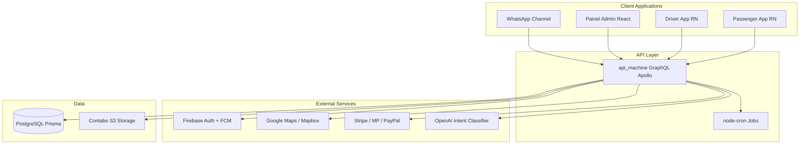

# Case Study — Broom

**Version:** 3.0  
**Status:** Approved  
**Last updated:** 2026-07-06  
**Type:** Prior production system (narrative documentation, source not in this repository)

---

## Overview

Broom is a white-label ride-hailing platform (Brasil Machine instance) powering regional mobility brands across Brazil. A single codebase serves 20+ franchise operators with passenger and driver mobile apps, an operations panel, WhatsApp booking, and multi-gateway payments.

**Role:** Lead engineer — GraphQL API, mobile app architecture, WhatsApp integration, multi-tenant data model.  
**Production:** api.broom.magicsoft.com.br, painel.broom.magicsoft.site

---

## Business Problem

Regional urban mobility brands (taxi, mototaxi, app-based transport) need on-demand ride services, but building a complete platform — passenger and driver apps, operations panel, payments, notifications — is expensive and slow. Each city or franchise wants its own brand, support channels, and pricing rules without maintaining a separate codebase per operation.

---

## Requirements

| Category    | Requirement                                                   |
| ----------- | ------------------------------------------------------------- |
| White-label | Per-franchise branding, credentials, and pricing              |
| Mobile      | Passenger and driver React Native apps (iOS/Android)          |
| Operations  | Admin panel: franchises, drivers, call center, live metrics   |
| Booking     | App, WhatsApp, and call-center channels                       |
| Payments    | Stripe, Mercado Pago, PayPal, PIX per franchise               |
| Matching    | Driver-passenger matching with push and WhatsApp notification |
| Real-time   | Live dashboard: revenue, rides, online drivers                |

---

## Architecture

Broom uses a **multi-app monorepo** with a central GraphQL API and React Native + web clients.

| Component           | Responsibility                                        |
| ------------------- | ----------------------------------------------------- |
| `api_machine`       | GraphQL API, webhooks, cron matching and cancellation |
| `passenger_machine` | Passenger app: map, request, history, wallet          |
| `driver_machine`    | Driver app: rides, meter, financials, vehicle         |
| `painel_machine`    | Admin: franchises, drivers, call center, metrics      |

---

## System Diagram

---

## Technology Stack

| Layer       | Technology                                                          |
| ----------- | ------------------------------------------------------------------- |
| Backend     | Node.js, TypeScript, Express, Apollo Server, type-graphql, Prisma 4 |
| Mobile      | React Native 0.69, Apollo Client, React Navigation                  |
| Admin       | React 18, PrimeReact, Mapbox GL, Chart.js                           |
| Database    | PostgreSQL                                                          |
| Auth / Push | Firebase Auth, Firebase Messaging, Notifee                          |
| Maps        | Google Maps, Mapbox, Azure Geocoding, Nominatim fallback            |
| Payments    | Stripe, Mercado Pago, PayPal, PIX                                   |
| Messaging   | WhatsApp Business API, Evolution API, OpenAI gpt-4o-mini            |
| Storage     | Contabo Spaces (S3-compatible)                                      |
| Jobs        | node-cron (matching, cancellation, driver heartbeat)                |

---

## Key Features

1. **Franchise multi-tenancy** — Branding, API keys, payment credentials, Firebase, WhatsApp per franchise
2. **Ride lifecycle** — `AWAIT` → `ACCEPTED_DRIVER` → `ON_ROUTE` → `EMBARKATION` → `COMPLETED`
3. **WhatsApp booking** — Legacy numbered flow + AI intent layer (`request_ride`, `become_driver`)
4. **WhatsApp-only drivers** — `use_whatsapp: true` with periodic location updates
5. **Call center** — Operators create bookings via GraphQL with map address selection
6. **Live dashboard** — Revenue, rides, cancellations, online drivers in real time
7. **Dynamic pricing** — Base fare + km + minute + peak hour multipliers per franchise/region

---

## Engineering Challenges

### Operational multi-tenancy

Each franchise requires Firebase project, payment gateways, WhatsApp instance, and map API keys — dozens of credential fields per tenant.

### Driver matching

20-second cron polling instead of event-driven architecture; radius logic (`max_meters_request_drivers`) with multi-channel notification.

### Dual WhatsApp systems

Legacy numbered flow and new AI layer running in parallel during incremental migration.

### Drivers without app

WhatsApp-only channel requires periodic location requests instead of continuous GPS.

### Geocoding fragmentation

Fallback chain across Google, Mapbox, Azure, and OpenStreetMap for cost and regional availability.

---

## Trade-offs

| Decision      | Chosen                     | Alternative              | Rationale                                               |
| ------------- | -------------------------- | ------------------------ | ------------------------------------------------------- |
| API style     | GraphQL                    | REST                     | Flexible queries for mobile apps with varied data needs |
| Matching      | Cron polling (20s)         | Event-driven (Redis/SQS) | Simpler ops for current volume; known scale limit       |
| Mobile        | React Native               | Native Swift/Kotlin      | Single codebase for 20+ brands                          |
| WhatsApp      | Dual flow during migration | Big-bang rewrite         | Zero downtime for active franchises                     |
| Money storage | Integer cents              | Decimal                  | Avoid floating-point display bugs                       |
| Tenant config | Single `Franchise` model   | Config service           | Faster white-label onboarding                           |

---

## Security

| Control            | Implementation                                  |
| ------------------ | ----------------------------------------------- |
| Authentication     | Firebase Auth (Google, Apple, email)            |
| API authorization  | GraphQL context with franchise + role           |
| Tenant isolation   | Franchise ID on all operational queries         |
| Payment webhooks   | Signature verification per gateway              |
| Credential storage | Per-franchise env fields; not in client bundles |
| Admin access       | Role flags (`is_callcenter`, franchise admin)   |

---

## Performance

| Area               | Approach                                                 |
| ------------------ | -------------------------------------------------------- |
| GraphQL            | Field-level resolvers; DataLoader patterns where applied |
| Matching cron      | 20s interval; configurable driver search radius          |
| Push notifications | Firebase FCM for instant driver alerts                   |
| Dashboard          | Aggregated queries against PostgreSQL; live refresh      |
| File storage       | S3-compatible object storage for franchise assets        |

---

## Scalability

| Dimension    | Strategy                                                            |
| ------------ | ------------------------------------------------------------------- |
| Franchises   | Shared API; franchise-scoped data and credentials                   |
| Rides        | Horizontal API scaling; stateless GraphQL handlers                  |
| Matching     | Cron bottleneck at high volume — documented migration path to queue |
| Mobile users | Firebase handles auth scale; CDN for static assets                  |
| Storage      | S3-compatible bucket per environment                                |

---

## Deployment

| Component   | URL                         | Platform                              |
| ----------- | --------------------------- | ------------------------------------- |
| API         | api.broom.magicsoft.com.br  | CapRover / Docker                     |
| Admin panel | painel.broom.magicsoft.site | CapRover / Docker                     |
| Mobile apps | App Store / Play Store      | Per-franchise branded builds          |
| Franchises  | 20+ brands                  | Shared codebase, per-franchise config |

Brands include Seu Motorista, ATA MOBI, Bora Lá, MotoboyLeva, Vai de Mob, among others.

---

## Lessons Learned

1. **White-label needs a generous data model** — Per-franchise credentials and branding from day one prevent per-client forks.
2. **WhatsApp is a product channel** — Booking, registration, and driver operation via chat extend reach beyond the app.
3. **Simple cron works to a point** — Polling-based matching is operational but event-driven scales better at volume.
4. **Incremental migration creates visible debt** — Two WhatsApp flows coexist; plan deprecation explicitly.
5. **Cents everywhere** — Integer money in schema requires discipline across the entire stack.

---

## Screenshots

| Screen            | Location            | Description                    |
| ----------------- | ------------------- | ------------------------------ |
| Live dashboard    | painel → Dashboard  | Revenue, rides, online drivers |
| Franchise config  | painel → Franchises | Branding, credentials, regions |
| Active rides map  | painel → Monitor    | Real-time ride tracking        |
| Driver management | painel → Drivers    | Approval, plans, financials    |

_Screenshots available on request during technical interviews._

---

## Roadmap (at handoff)

| Phase | Item                           | Status      |
| ----- | ------------------------------ | ----------- |
| v1.0  | App + panel + matching         | Shipped     |
| v1.5  | WhatsApp booking               | Shipped     |
| v2.0  | AI intent layer on WhatsApp    | Shipped     |
| v2.5  | Deprecate legacy WhatsApp flow | In progress |
| v3.0  | Event-driven matching          | Planned     |

---

## Relation to NovaDesk

Concepts from Broom that inform NovaDesk:

- Multi-tenancy by franchise/organization (Auth tenants, HelpDesk workspaces)
- Well-defined lifecycle states (tickets, SLA)
- Cron/workers for periodic tasks (Notification Service)
- Operations panel with live metrics (Analytics Dashboard)
- Multi-channel integration (chat, email, notifications)
