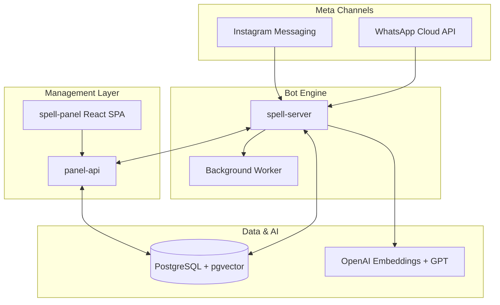

# Case Study — Spell

**Version:** 3.0  
**Status:** Approved  
**Last updated:** 2026-07-06  
**Type:** Prior production system (narrative documentation, source not in this repository)

---

## Overview

Spell is a multi-tenant SaaS platform that automates customer service on WhatsApp and Instagram using RAG-grounded AI, visual conversation flows, human handoff, scheduling, and integrated billing. It is in production at [spelltalk.com.br](https://spelltalk.com.br).

**Role:** Lead engineer — architecture, backend, integrations, and deployment.  
**Scale:** Multi-tenant production deployment with white-label instances.

---

## Business Problem

Brazilian businesses depend on WhatsApp and Instagram for customer service, but manual responses do not scale: queues grow, off-hours go uncovered, and inconsistent answers hurt conversion. Generic chatbots frequently invent information or ignore the business knowledge base. The market needed an automated attendant on Meta's official APIs with reliable human handoff when automation is insufficient.

---

## Requirements

| Category   | Requirement                                                            |
| ---------- | ---------------------------------------------------------------------- |
| Functional | Multi-tenant SaaS with per-tenant KB, agents, and billing              |
| Channels   | WhatsApp Cloud API and Instagram Messaging API                         |
| AI         | RAG responses grounded in uploaded documents — no hallucinated pricing |
| Handoff    | Human agent takeover with Meta template compliance                     |
| Automation | Visual flow builder for non-Q&A journeys (scheduling, data collection) |
| Billing    | Stripe, Mercado Pago, PIX with package entitlements                    |
| Operations | Admin panel, conversation history, operational metrics                 |

---

## Architecture

Spell adopted a **three-service monorepo** with shared PostgreSQL (pgvector) and internal communication between the bot engine and management API.

| Service        | Responsibility                                                         |
| -------------- | ---------------------------------------------------------------------- |
| `spell-server` | Meta webhooks, RAG/visual bot engine, handoff relay, background worker |
| `panel-api`    | Auth, tenant admin, KB, agents, billing, integrations, public API      |
| `spell-panel`  | React SPA for tenant and platform administration                       |

---

## System Diagram

---

## Technology Stack

| Layer    | Technology                                    |
| -------- | --------------------------------------------- |
| Backend  | Node.js 20, TypeScript, Fastify 4, Prisma 6   |
| Frontend | React 18, Vite 5, React Router, @xyflow/react |
| Database | PostgreSQL 16 with pgvector extension         |
| AI       | OpenAI gpt-4o-mini, text-embedding-3-small    |
| Channels | WhatsApp Cloud API, Instagram Messaging API   |
| Payments | Stripe, Mercado Pago, manual PIX              |
| Calendar | Google Calendar OAuth, Calendly               |
| Deploy   | Docker, CapRover                              |

---

## Key Features

1. **RAG knowledge base** — PDF, DOCX, XLSX chunked and embedded; cosine similarity retrieval with response verifier
2. **Visual flows** — Node-based builder for messages, options, data collection, timers, scheduling
3. **Human handoff** — State machine: `BOT_ACTIVE` → `HANDOFF_PENDING` → `HUMAN_ACTIVE` → `CLOSED`
4. **Multi-channel** — Same tenant logic across WhatsApp and Instagram
5. **Package entitlements** — Agent limits, conversation quotas, KB entries, flow node caps
6. **White-label deploy** — Separate CapRover apps per branded instance

---

## Engineering Challenges

### RAG alignment

Generic LLMs invent prices and policies. The product requires retrieval with minimum similarity thresholds and a verification loop before sending any response.

### WhatsApp 24-hour window

Human relay outside the messaging window requires Meta-approved templates, provisioned per tenant automatically.

### Meta platform constraints

Instagram permissions, app review cycles, and comment reply limits directly impact feature availability and roadmap.

### Multi-tenant billing

Entitlements must enforce limits in real time across server and panel-api via shared `package-entitlements` module.

---

## Trade-offs

| Decision    | Chosen                   | Alternative              | Rationale                                                       |
| ----------- | ------------------------ | ------------------------ | --------------------------------------------------------------- |
| Bot runtime | Dedicated `spell-server` | Single API               | Webhook latency isolation from admin CRUD                       |
| ORM         | Prisma                   | Raw SQL                  | Type safety and migration velocity for small team               |
| AI model    | gpt-4o-mini              | Larger models            | Cost control at scale; RAG quality matters more than model size |
| Monorepo    | 3 services, 1 DB         | Microservices per tenant | Operational simplicity for current scale                        |
| Handoff     | Fan-out to all agents    | Round-robin queue        | Faster first response in WhatsApp context                       |

---

## Security

| Control              | Implementation                                                      |
| -------------------- | ------------------------------------------------------------------- |
| Tenant isolation     | `phoneNumberId` resolves tenant on every webhook                    |
| Webhook verification | Meta signature validation on inbound events                         |
| API auth             | JWT for panel-api; API keys for public integrations                 |
| KB access            | Documents scoped per tenant; embeddings never cross tenant boundary |
| Payments             | Stripe/Mercado Pago webhooks with signature verification            |
| Secrets              | Environment variables per CapRover app; no keys in repository       |

---

## Performance

| Area             | Approach                                                                    |
| ---------------- | --------------------------------------------------------------------------- |
| Embedding search | pgvector index on `KnowledgeChunk.embedding`; top-k with score threshold    |
| Webhook response | Async worker for heavy processing; immediate 200 to Meta                    |
| Caching          | Session state in PostgreSQL; hot tenant config cached in memory             |
| Background jobs  | Worker for handoff retries, inactive session cleanup, template provisioning |

Operational metrics (conversations/day, customers served) available in production admin panel.

---

## Scalability

| Dimension | Strategy                                                                            |
| --------- | ----------------------------------------------------------------------------------- |
| Tenants   | Shared infrastructure; tenant ID on all rows                                        |
| Messages  | Horizontal scale of `spell-server` behind load balancer; stateless webhook handlers |
| KB size   | Chunked documents; embedding batch jobs off peak                                    |
| Agents    | Per-package agent limits enforced at connection time                                |

---

## Deployment

| Environment | URL                                  | Notes                           |
| ----------- | ------------------------------------ | ------------------------------- |
| Panel       | panel.spelltalk.com.br               | React SPA via CapRover          |
| API         | api.spelltalk.com.br                 | panel-api                       |
| Server      | server.spelltalk.com.br              | Webhook + worker                |
| White-label | spellserver.projetovendermais.com.br | Separate CapRover branch deploy |

Three `captain-definition` files — one per deployable unit with independent Git branches.

---

## Lessons Learned

1. **RAG with verifier is the differentiator** — Grounded answers beat a larger model without guardrails.
2. **Handoff is a feature, not a fallback** — Templates, relay, and worker logic are as critical as the bot.
3. **Meta sets the rules** — Permissions, 24h windows, and app review directly shape the roadmap.
4. **Visual flows complement KB** — Not all support is Q&A; scheduling and data collection need structured automation.
5. **Three-service split** — Separating bot engine from admin API enables independent deploy and scale.

---

## Screenshots

Production URLs (access requires tenant credentials):

| Screen            | URL                    | Description                                     |
| ----------------- | ---------------------- | ----------------------------------------------- |
| Tenant dashboard  | panel.spelltalk.com.br | KB management, flow builder, conversation inbox |
| Flow builder      | panel → Flows          | Visual node editor (@xyflow/react)              |
| Conversation view | panel → Conversations  | Handoff state, message history                  |
| Admin metrics     | panel → Analytics      | Conversations/day, active customers             |

_Screenshots available on request during technical interviews._

---

## Roadmap (at handoff)

| Phase | Item                            | Status     |
| ----- | ------------------------------- | ---------- |
| v1.0  | WhatsApp RAG + handoff          | Shipped    |
| v1.1  | Visual flows + scheduling       | Shipped    |
| v1.2  | Instagram DM + comment triggers | Shipped    |
| v2.0  | Advanced analytics dashboard    | Planned    |
| v2.1  | Voice channel integration       | Evaluating |

---

## Relation to NovaDesk

Concepts from Spell that inform NovaDesk:

- Multi-tenancy with tenant isolation (Auth Service, HelpDesk)
- Async workers and queues (Notification Service, BullMQ)
- RAG as extensibility pattern (future HelpDesk AI module)
- Package entitlements model for SaaS billing
- Webhook and API key integration patterns
