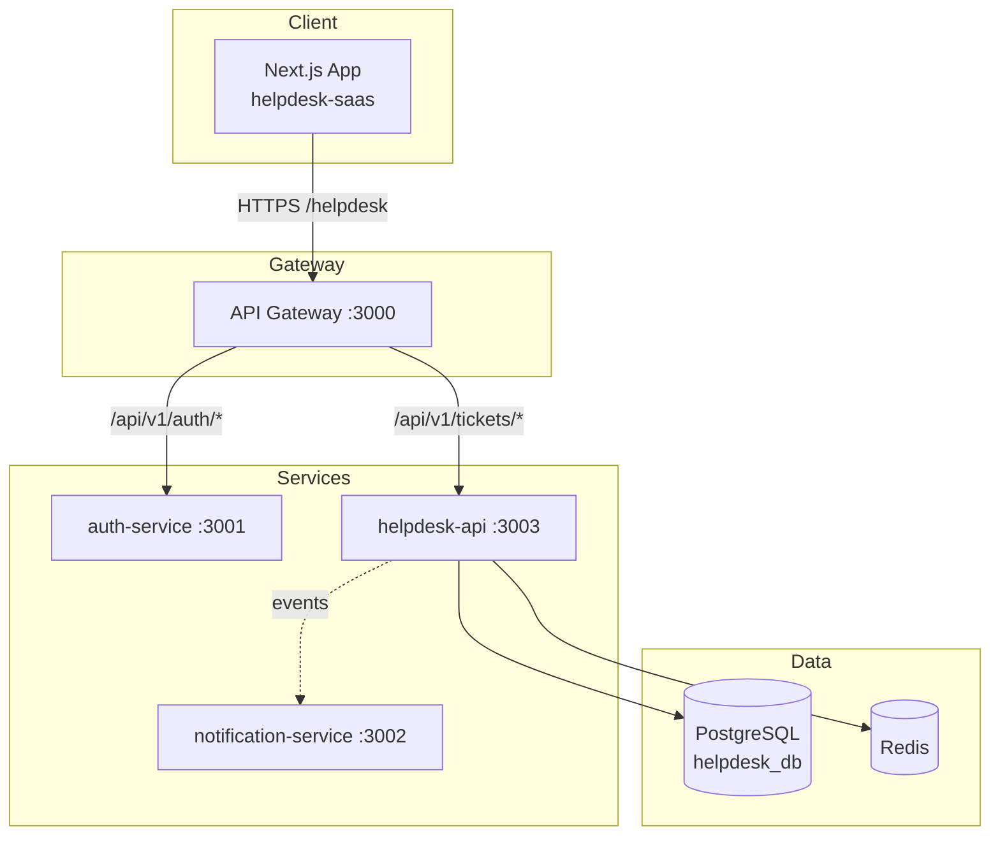

# Helpdesk SaaS — Flagship Application

**Helpdesk SaaS** is the principal project of Portfolio OS: a modern, multi-tenant customer support platform designed for AI-assisted workflows. This repository contains the **architecture scaffold** — folder structure, module boundaries, data model, and documentation — without business logic implementation.

| Component   | Path                    | Package                    | Port |
| ----------- | ----------------------- | -------------------------- | ---- |
| Frontend    | `apps/helpdesk-saas`    | `@portfolio/helpdesk-saas` | 3010 |
| Backend API | `services/helpdesk-api` | `@portfolio/helpdesk-api`  | 3003 |

**Public URL (via Nginx):** `/helpdesk`

---

## Vision

Deliver a production-grade helpdesk that demonstrates:

- **Clean Architecture** on the backend (domain → application → infrastructure → presentation)
- **Feature-Sliced Design** on the frontend (features, entities, widgets, shared)
- **Multi-tenancy** via organizations, workspaces, and RBAC
- **AI-ready** module boundaries without premature AI coupling
- **Portfolio OS integration** via shared packages (`@portfolio/ui`, `@portfolio/shared`, `@portfolio/auth`, `@portfolio/sdk`, `@portfolio/logger`, `@portfolio/config`)

---

## Architecture Overview



See [docs/ARCHITECTURE.md](./docs/ARCHITECTURE.md) for detailed diagrams and module flows.

---

## Repository Structure

### Backend (`services/helpdesk-api`)

```
src/
├── main.ts
├── app.module.ts
├── infrastructure/     # Database, queue, observability, swagger
├── presentation/       # Health, metrics, guards, middlewares, filters
└── modules/            # Bounded contexts (22 modules)
    ├── tickets/
    │   ├── domain/entities/
    │   ├── application/{ports,dto,use-cases}/
    │   ├── infrastructure/persistence/
    │   └── presentation/{controllers,validators}/
    ├── users/
    ├── organizations/
    └── ...
prisma/
└── schema.prisma       # Initial data model
```

### Frontend (`apps/helpdesk-saas`)

```
src/
├── app/                # Next.js App Router (routes)
│   ├── (app)/          # Authenticated shell
│   └── (auth)/         # Login / registration
├── features/           # Feature slices (tickets, inbox, settings, ...)
├── entities/           # Domain models (ticket, user, workspace, ...)
├── widgets/            # Composed UI blocks (sidebar, header, app-shell)
└── shared/             # Providers, hooks, stores, services, lib
```

---

## Modules

| Backend Module                       | Responsibility                            |
| ------------------------------------ | ----------------------------------------- |
| `auth`                               | Session context, workspace scoping        |
| `users`                              | Agent profiles                            |
| `organizations`                      | Top-level tenant                          |
| `workspaces`                         | Operational unit within org               |
| `teams`                              | Agent groups                              |
| `permissions` / `roles`              | RBAC                                      |
| `customers` / `contacts`             | End-user identity                         |
| `tickets` / `messages`               | Core support workflow                     |
| `channels`                           | Email, chat, phone, API intake            |
| `automations`                        | Rule engine (scaffold)                    |
| `knowledge-base`                     | Self-service articles                     |
| `ai`                                 | AI context boundaries (no implementation) |
| `notifications`                      | In-app alerts                             |
| `settings`                           | Workspace configuration                   |
| `audit`                              | Compliance trail                          |
| `files`                              | Attachments                               |
| `dashboard` / `analytics` / `search` | Read models                               |

---

## Getting Started

### Prerequisites

- Node.js ≥ 20
- pnpm 9
- PostgreSQL 16, Redis 7 (via `infrastructure/docker-compose.yml`)

### Backend

```bash
cp services/helpdesk-api/.env.example services/helpdesk-api/.env
pnpm install
pnpm --filter @portfolio/helpdesk-api db:generate
pnpm --filter @portfolio/helpdesk-api dev
```

API: `http://localhost:3003/api/v1`  
Swagger: `http://localhost:3003/api/docs`

### Frontend

```bash
pnpm --filter @portfolio/helpdesk-saas dev
```

App: `http://localhost:3010/helpdesk`

---

## Design Decisions

| Decision                              | Rationale                                                                       |
| ------------------------------------- | ------------------------------------------------------------------------------- |
| Modular monolith (single API service) | Simpler ops for portfolio demo; clear module boundaries allow future extraction |
| Workspace-scoped multi-tenancy        | Industry-standard B2B SaaS pattern                                              |
| Prisma for persistence                | Consistent with Portfolio OS stack                                              |
| No business logic in scaffold         | Enables incremental, test-driven implementation per backlog item                |
| AI as isolated module                 | Prevents coupling; AI features plug in via ports                                |

Formal record: [docs/adr/0001-architecture-foundation.md](./docs/adr/0001-architecture-foundation.md)

---

## Roadmap

See [docs/ROADMAP.md](./docs/ROADMAP.md) for phased delivery (M1–M6).

---

## Status

| Area                    | Status                            |
| ----------------------- | --------------------------------- |
| Folder structure        | ✅ Complete                       |
| Module boundaries       | ✅ Complete                       |
| Prisma schema (initial) | ✅ Complete                       |
| API endpoints           | 🔲 Scaffold only (throws / empty) |
| Frontend UI             | 🔲 Shell only                     |
| Business logic          | 🔲 Not started                    |
| Tests                   | 🔲 Infrastructure tests pending   |

---

## Related Documentation

- [Portfolio OS Master Spec](../../PORTFOLIO_OS_MASTER_SPEC.md)
- [Service Catalog](../../docs/16-Service-Catalog.md)
- [Coding Standards](../../docs/03-Coding-Standards.md)
- [Data Architecture](../../docs/17-Data-Architecture.md)

---

**License:** See [00-governance/LICENSE](../../00-governance/LICENSE)
