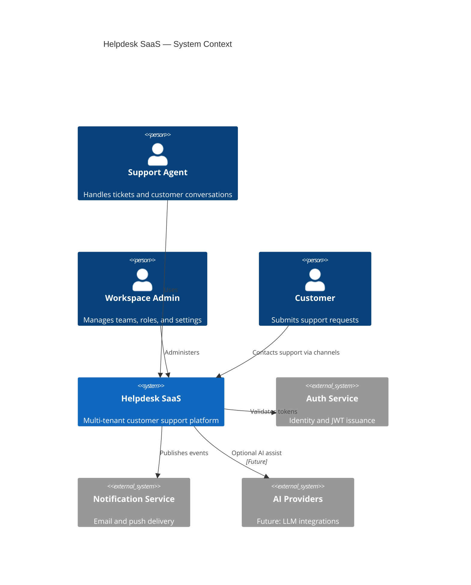
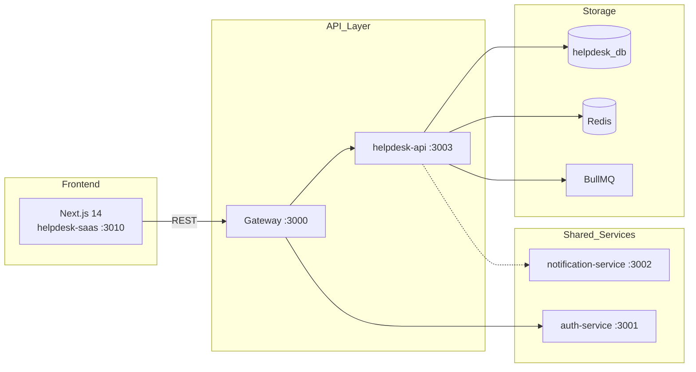
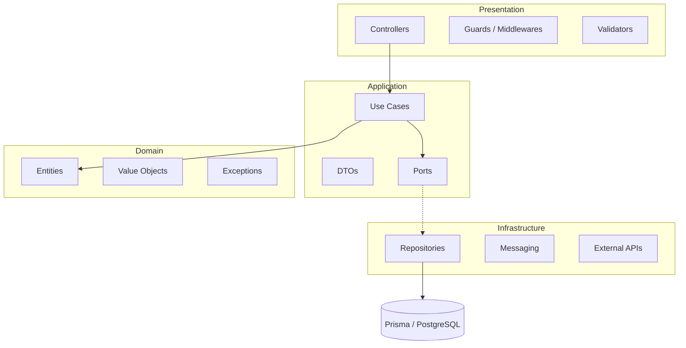
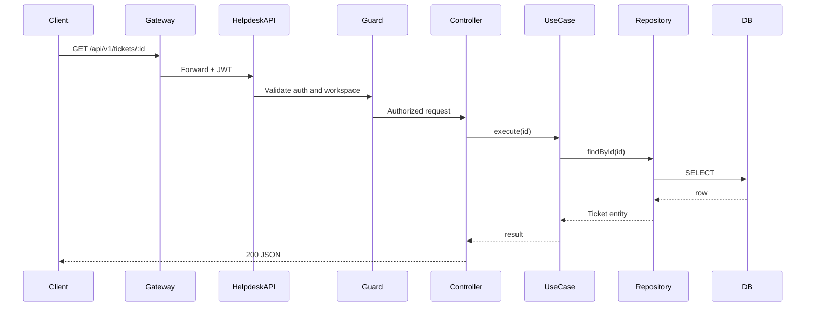
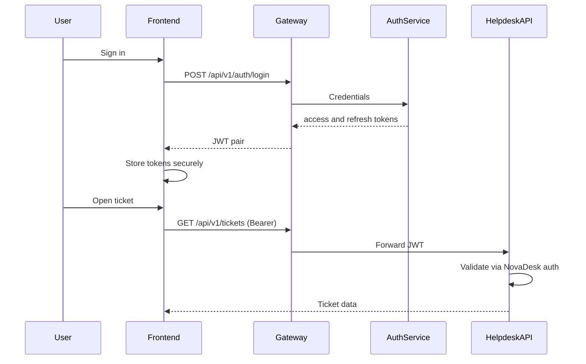
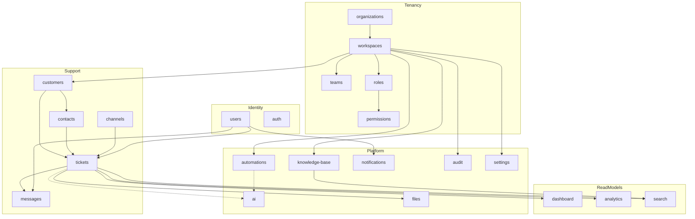
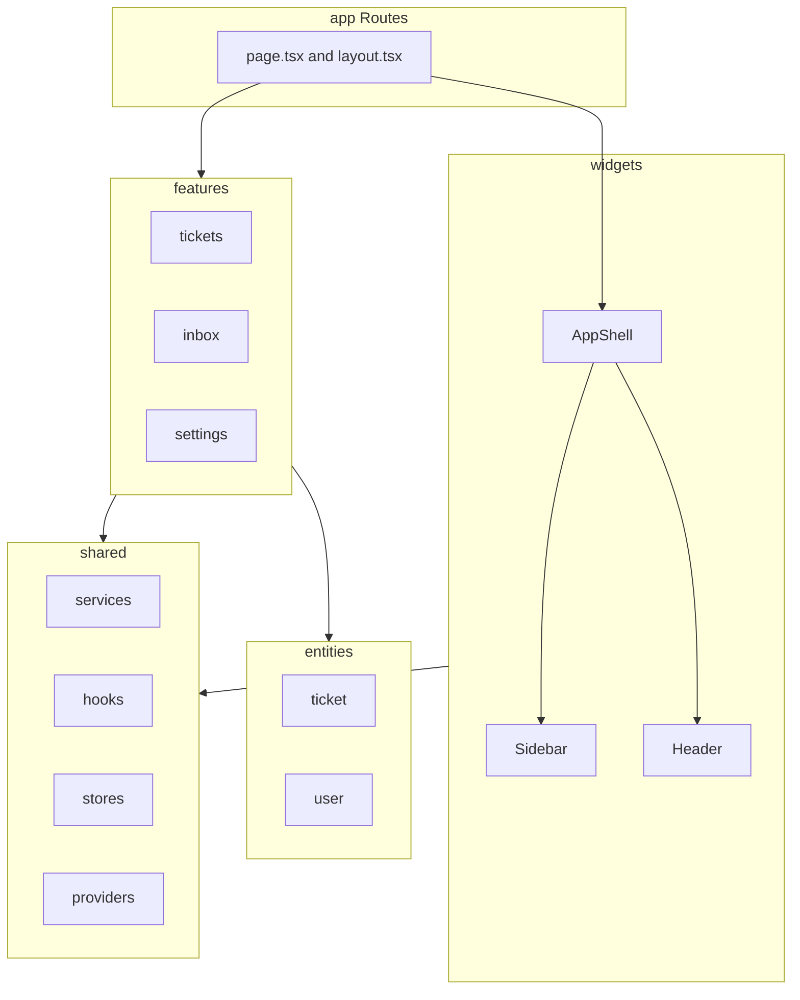
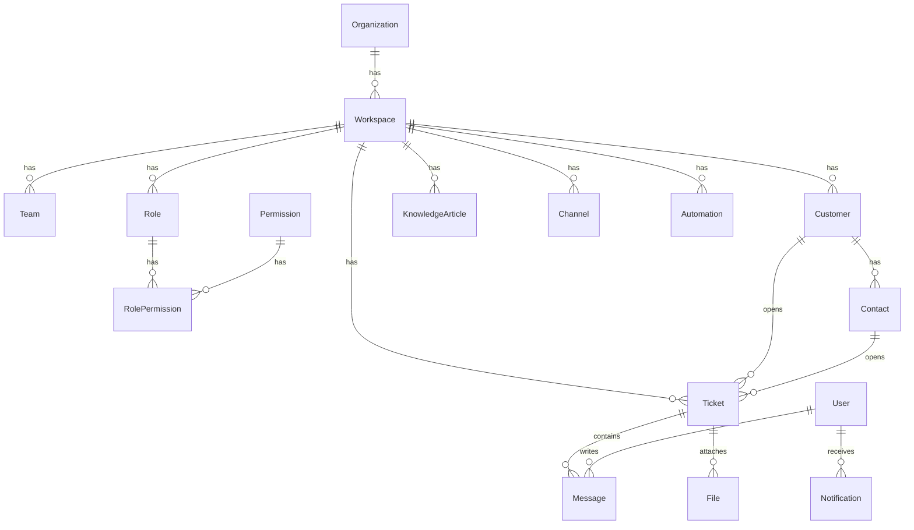
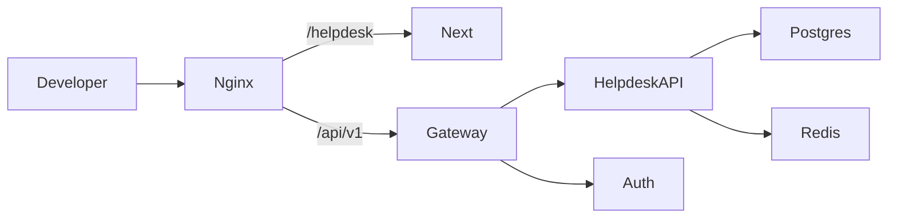

# Helpdesk SaaS — System Architecture

**Version:** 0.1.0 (scaffold)  
**Status:** Foundation  
**Last updated:** 2026-07-03

---

## 1. System Context

---

## 2. Container Diagram

---

## 3. Backend Layer Architecture

Each bounded context follows **Clean Architecture**:

**Dependency rule:** dependencies point inward. Domain has zero framework imports.

---

## 4. Application Request Flow

---

## 5. Authentication Flow

---

## 6. Module Interaction Map

---

## 7. Frontend Architecture (FSD)

**Import rule:** `app → widgets → features → entities → shared` (no upward imports).

---

## 8. Data Model (Core Entities)

Full schema: `prisma/schema.prisma`

---

## 9. Deployment Topology (Local)

---

## 10. Implementation Status (2026-07-03)

| Area                                   | Status                                |
| -------------------------------------- | ------------------------------------- |
| Organizations, Workspaces              | ✅ Implemented                        |
| Customers, Contacts                    | ✅ Implemented                        |
| Tickets, Messages                      | ✅ Implemented                        |
| Dashboard stats                        | ✅ Implemented                        |
| Auth integration (Gateway JWT headers) | ✅ Implemented                        |
| Knowledge Base, Search, AI             | 🔲 Scaffold                           |
| Channels, Automations                  | 🔲 Scaffold                           |
| Real-time WebSocket                    | 🔲 Delegated to realtime-chat service |

---
