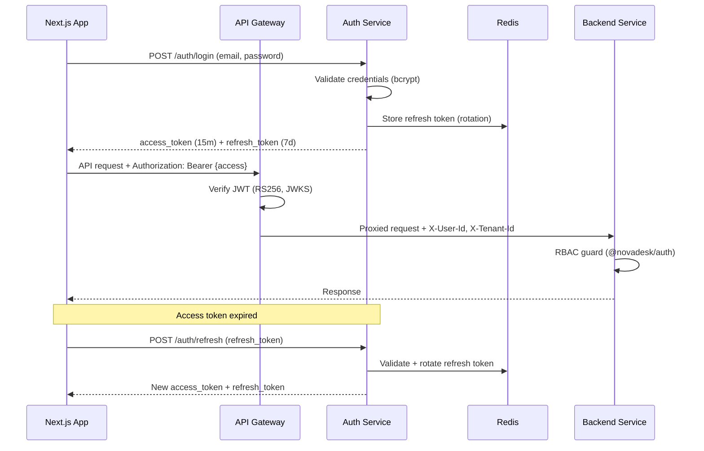

# Authentication Flow

**Version:** 1.0  
**Status:** Approved  
**Last updated:** 2026-07-06

---

## Overview

NovaDesk uses a **centralized Auth Service** as the identity provider. All applications obtain JWT access tokens and refresh tokens through this service. The API Gateway validates access tokens on every protected request before proxying to backend services.

---

## System diagram

---

## Token specification

| Token   | Algorithm       | TTL        | Storage                           |
| ------- | --------------- | ---------- | --------------------------------- |
| Access  | RS256           | 15 minutes | Memory (client)                   |
| Refresh | Opaque / signed | 7 days     | HttpOnly cookie or secure storage |

### Access token claims

| Claim       | Purpose                 |
| ----------- | ----------------------- |
| `sub`       | User ID                 |
| `email`     | User email              |
| `roles`     | RBAC roles              |
| `tenant_id` | Multi-tenant scope      |
| `scope`     | API permissions         |
| `jti`       | Token ID for revocation |

---

## RBAC model

Hierarchy: **Organization → Workspace → Resources**

| Layer      | Enforcement                                 |
| ---------- | ------------------------------------------- |
| Gateway    | JWT signature, expiry, issuer               |
| Service    | `@Roles()` decorator via `@novadesk/auth`   |
| Repository | `workspace_id` scoping on all tenant tables |

---

## Security controls

1. **RS256** — Private key on Auth Service only; public key via JWKS endpoint
2. **Refresh rotation** — Each refresh invalidates the previous token
3. **Rate limiting** — Login and refresh endpoints throttled at gateway
4. **Fail secure** — Invalid or expired token → 401, never passthrough
5. **Audit log** — Login, logout, and role changes recorded

---

## Multi-tenant isolation

Tenants are resolved from JWT `tenant_id`. Services never accept tenant ID from request body on protected routes — only from validated token claims. WorkspaceGuard enforces workspace membership on HelpDesk and Admin routes.

---

## Related documentation

- [07-Security.md](../../../docs/07-Security.md) — Full security strategy
- [ADR-0002: NestJS Microservices](../../../docs/adr/0002-nestjs-microservices.md)
- Live implementation: `services/auth-service/`
