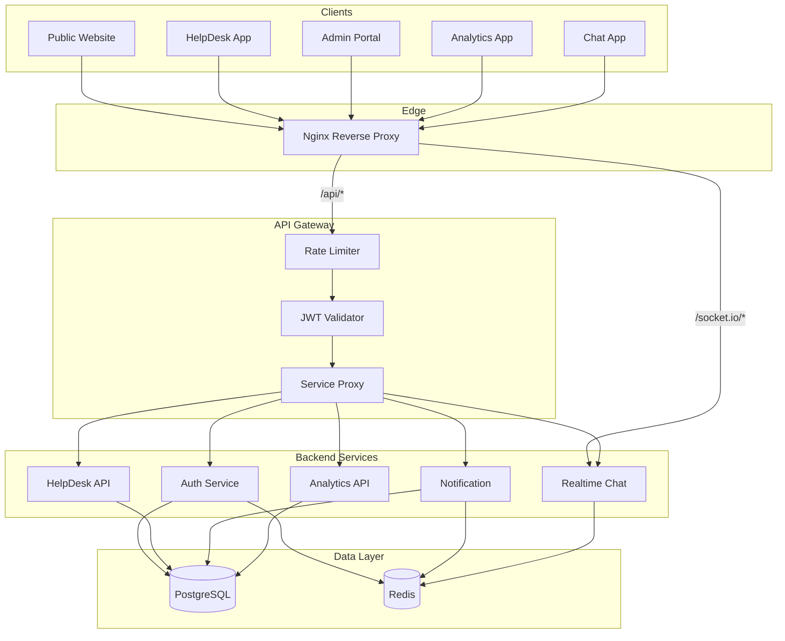

# Request Flow

**Version:** 1.0  
**Status:** Approved  
**Last updated:** 2026-07-06

---

## Overview

All client applications communicate with backend services through a **single API Gateway**. Nginx terminates TLS and routes path prefixes to the correct container. The gateway validates authentication, applies rate limits, and proxies to the target microservice.

---

## System diagram

---

## HTTP request lifecycle

1. **Client** sends request to `/api/v1/{service}/{resource}`
2. **Nginx** routes `/api/*` to API Gateway container
3. **Gateway** assigns `X-Request-Id` for correlation
4. **Rate limiter** checks Redis sliding window per IP/user
5. **JWT middleware** validates Bearer token (public routes exempt)
6. **Proxy** forwards to target service with identity headers
7. **Service** runs guards, validation, use case, repository
8. **Response** returns through gateway with consistent error envelope

---

## Path routing (Nginx)

| Path prefix   | Target                        |
| ------------- | ----------------------------- |
| `/`           | Website (Next.js)             |
| `/helpdesk/`  | HelpDesk SaaS                 |
| `/analytics/` | Analytics Dashboard           |
| `/admin/`     | Admin Portal                  |
| `/chat/`      | Realtime Chat                 |
| `/api/`       | API Gateway                   |
| `/socket.io/` | WebSocket upgrade via Gateway |

---

## Observability

| Signal     | Implementation                                          |
| ---------- | ------------------------------------------------------- |
| Request ID | `X-Request-Id` header propagated via `@novadesk/logger` |
| Metrics    | Prometheus `/metrics` on each service                   |
| Health     | `/health` and `/health/ready` endpoints                 |
| Logs       | Structured JSON (Pino) with correlation                 |

---

## Error handling

Gateway normalizes error responses:

| Status | Meaning                        |
| ------ | ------------------------------ |
| 401    | Missing or invalid JWT         |
| 403    | Valid token, insufficient role |
| 429    | Rate limit exceeded            |
| 502    | Upstream service unavailable   |
| 504    | Upstream timeout               |

---

## Related documentation

- [01-Architecture.md](../../../docs/01-Architecture.md)
- [16-Service-Catalog.md](../../../docs/16-Service-Catalog.md)
- [ADR-0007: API Gateway Pattern](../../../docs/adr/0007-api-gateway-pattern.md)
